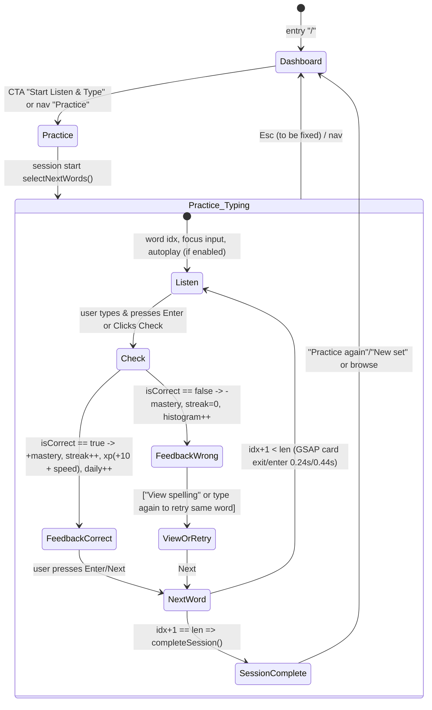

# User Flow: Lexis IELTS Spelling Training

**Slug**: ielts-spelling-training
**Created**: 2026-09-07
**Visualises**: spec.md user stories + implemented routes in `src/App.tsx:10-22`

## Route Map

```
/ (Dashboard)
/practice[?mode=listen|normal|mistakes|weak|quick10|challenge50|random|smart&len=20]
/mistakes
/words[?search=...]
/statistics
/settings
```

AppShell persists: Sidebar 260px (lg) + Mobile drawer 84% (sm) + Topbar sticky 56/64px + main Outlet with GSAP page transition `src/components/layout/AppShell.tsx:165-171` + SmoothScroll + footer.

## Primary Flow: Listen & Type Session (P1)



**Step-by-step (happy path):**
1. User lands on Dashboard (`src/pages/Dashboard.tsx:78-94` hero + daily ring + level).
2. Clicks "Start Listen & Type" → navigates `/practice?mode=listen`.
3. `useEffect` on mount: `selectNextWords(WORDS, envelope.wordProgress, "listen", sessionLength=20, adaptiveEnabled)` → wordList state; `startSession("listen", wordIds)` creates Session with `wordIds` and increments `streak.totalSessions` (`src/pages/Practice.tsx:30-65, src/store/useAppStore.ts:150`).
4. For each word `w = wordList[idx]`:
   a. Input auto-focused, tier badge shown via `getTier(progress[w.id]?.masteryScore ?? 50)` (`src/pages/Practice.tsx:269`).
   b. Auto-play after 350ms if `settings.autoPlay && soundEnabled`; user may click Replay (normal rate 0.9) or Slow (0.62) → `audioService.speak` + Web Audio ready (`src/pages/Practice.tsx:72-76, 95-104, src/services/audio.ts:68`).
   c. User types; each keystroke plays `typeTick(c)`/`typeBackspace()` via `useUiSound` (`src/pages/Practice.tsx:186-193`).
   d. User presses Enter or clicks Check → `handleCheck()` captures elapsed `Date.now()-startedAt` as responseMs, calls `recordAttempt(word.id, typed, normalized, responseMs, "listen")` which inside does `analyzeMistake` → updates `WordProgress` (attempts, masteryScore via `updateMastery`, histogram, avgResponseMs), pushes Attempt, bumps `dailyProgress[today].count`, calls `updateStreak()` (`src/store/useAppStore.ts:91-147`).
   e. UI transitions to `correct` (emerald border + +10 XP badge + streak fires) or `wrong` (red border + "Not quite" + View spelling) with GSAP scale 0.99→1 or -2→0 x shake (`src/pages/Practice.tsx:106-136`).
   f. If wrong and user starts typing again before Next, state resets to `typing` clearing feedback but keeping same idx so retry counts as new attempt (`src/pages/Practice.tsx:175-183`).
   g. Press Next → GSAP exit `opacity 0, y -6, scale 0.985 0.24s` then enter `y 10 0.44s cubic 0.16,1,0.3,1`; advances idx or if last, calls `completeSession(sessionId, results)` which sets correctCount/wrongCount/avgResponseMs/xpEarned, updates gamification level & personalBests & achievements, persists (`src/pages/Practice.tsx:139-165, src/store/useAppStore.ts:171-195`).
5. SessionComplete card shows correct/wrong/avg ms, streak, CTA Practice again / New set (new `sessionKey` forces re-select) (`src/pages/Practice.tsx:244-267`).

**Keyboard map (spec FR-013):**

| Key | When | Action | File |
|-----|------|--------|------|
| Enter | typing/wrong | Check | `Practice.tsx:197-201` |
| Enter | correct/revealed | Next | same |
| Enter (global, not input focused) | any | same dispatch | `Practice.tsx:221-232` |
| Space | !isTyping (input not focused) | Play normal | `Practice.tsx:211-214` |
| R / r | !isTyping | Play slow | `216-219` |
| N | — | Next (TODO fix) | missing per research Gap |
| Esc | — | Exit to Dashboard (TODO fix) | missing |
| Ctrl+Space | — | Play (hint shown but not wired) | `Practice.tsx:416` hint misleading |

## Dashboard Loop (P1 → P2)

```mermaid
flowchart LR
    S[Session complete] --> D[Dashboard hero]
    D --> A[Stats grid\nToday / Total / Streak\nMastered / PracticeTime]
    D --> W[Weakest 6\nsorted by masteryScore asc]
    D --> R[Recent 3 sessions\nmode • accuracy • XP]
    D --> Q[Quick CTA\nListen & Type card]
    W --> P[Click word -> /words?search=...]
    W --> M[View all -> /mistakes]
    R --> S2[/statistics CTA]
    Q --> S
```

- ProgressRing `daily count/goal` + XP `scaleX(pct)` bar with text `% to next level` (`src/pages/Dashboard.tsx:94-108`).
- StatCard staggered GSAP `y 12→0 opacity 0→1 stagger 0.07` unless reduced motion (`src/pages/Dashboard.tsx:33-48`).

## Weakness & Mistakes Flow (P2)

```mermaid
flowchart TD
    D[Dashboard weakest] --> MI[/mistakes]
    MI --> B1[Mistake types badges\nmistakeBreakdown + mistakeColor]
    MI --> B2[Weak words grid 12\ncards with acc & lastMistakeType]
    MI --> B3[Recent mistakes 20\nword, typed red, mode, ms, badge]
    B2 --> PR[/practice?mode=mistakes]
    B3 --> W[/words detail]
```

- `weakest = wordProgress.where wrong>0 sorted masteryScore asc || wrong desc slice 12` (`src/pages/Mistakes.tsx:14-18`).
- `breakdown = Map mistakeType -> count sorted desc` (`src/pages/Mistakes.tsx:21-25`).
- Empty → ✓ card "You haven't made any spelling mistakes yet." (`Mistakes.tsx:37-42`).

## Word Library Flow (P2)

```mermaid
flowchart LR
    W[/words] --> F[Filters\nSearch normalized includes\nCategory 36 opts\nMastery 8 pills]
    F --> L[List 400 cap\ndivide-y buttons]
    L --> D[Detail pane sticky\nAttempts Correct Wrong\ntier badge accuracy\nStreaks AvgTime LastPracticed\nHistogram badges]
    D --> PR2[/practice CTA]
    W --> L2[URL ?search= prefilled]
```

- `filtered = WORDS.filter(search & category & mastery).slice(0,400)` (`src/pages/Words.tsx:23-36`).
- Selection `selected string|null` shows pane: if `selProg` exists grid 3 cols, else "Not practiced yet" (`Words.tsx:101-154`).

## Statistics Flow (P3)

```mermaid
flowchart TD
    S[/statistics] --> LG[Accuracy Over Time\nLineChart 14 days\naccuracyOverTime()]
    S --> PI[Mastery Pie\ninner 52 outer 78\n6 slices]
    S --> HM[Activity 35 days\ngrid 7 cols]
    S --> MB[Mistake Types\nBarChart]
    S --> CP[Category Perf\nHorizontal Bar top 8]
    HM --> D2[darker = more words]
```

- Heatmap intensity `0: muted, <10 amber-200, <25 orange-400, else red-500` (`src/pages/Statistics.tsx:110`).
- GSAP `stat-chart y12→0 stagger 0.08` unless no attempts (`Statistics.tsx:15-23`).
- Empty attempts → "No data yet" card (`Statistics.tsx:64-68`).

## Settings & Persistence Flow (P2)

```mermaid
flowchart TD
    SE[/settings] --> A1[Appearance\nlight dark system]
    SE --> A2[Audio\nsoundEnabled volume autoPlay slowRate]
    SE --> A3[Practice\ndailyGoal 10/20/30/50/100+custom\nsessionLength 10/20/30/50\nadaptiveEnabled\ndefaultMode disabled listen]
    SE --> A4[Shortcuts grid\nEnter Space R N Esc]
    SE --> A5[Data\nExport Import Reset]
    A1 --> ST[useAppStore.updateSettings -> applyTheme + persist]
    A5 --> EXP[Blob JSON envelope]
    EXP --> RST[confirm reset]
    ST --> LS[(IDB + localStorage)]
```

- Theme: `applyTheme(theme)` toggles `documentElement.classList.dark` via `prefers-color-scheme` if system (`src/store/useAppStore.ts:277-283`).
- Volume init via `uiSound.init(volume, enabled)` + `audioService.setVolume` (`src/components/layout/AppShell.tsx:175-178`).

## Adaptive Decision Flow (System)

```mermaid
flowchart TD
    IN[selectNextWords words, progress, mode, count, adaptive] --> SW{mode?}
    SW -->|mistakes| PO1[pool = wrong>0 else all]
    SW -->|weak| PO2[pool = mastery≤59 & attempts>0 else lowest mastery slice]
    SW -->|other| PO3[pool = all]
    PO1 & PO2 & PO3 --> NEXT{mode + adaptive?}
    NEXT -->|random| SH[shuffle slice count]
    NEXT -->|quick10 no adaptive| SH2[shuffle 10]
    NEXT -->|quick10 adaptive| W1[sortByWeight top20 shuffle10]
    NEXT -->|challenge50| SH3[shuffle 50]
    NEXT -->|smart or normal/listen+adaptive| WS[weightedSample from top 80 candidate]
    WS --> OUT[result wordIds]
    SH & SH2 & W1 & SH3 --> OUT
    subgraph weight[weightFor w, prog]
      WF[if no prog -> 25±2.5]
      WF2[masteryFactor (100-mastery)/100^1.25*40]
      WF3[failFactor 1+wrongs*0.42]
      WF4[recency 2.4 if never, else gap>7 => 1+gap/24 up to 1.9, gap<0.2 & acc<0.7 =>1.45]
      WF5[accBoost 1.7 if <0.6 else 1.25 if <0.8 else 1]
      WF6[streakPenalty 0.42 if ≥4 else 0.72 if ≥2]
      JJ[jitter 0.88-1.12]
    end
    OUT -.-> weight
```

Weighted sampling: `total = sum weights, r=random*total, subtract until ≤0, pick idx, splice` without replacement (`src/services/adaptiveReview.ts:114-137`).

## Persistence & Streak Logic

```mermaid
sequenceDiagram
    participant U as User types
    participant S as useAppStore.recordAttempt
    participant P as WordProgress
    participant A as Attempts[]
    participant D as dailyProgress[today]
    participant ST as streak
    U->>S: recordAttempt(wordId, typed, normalized, ms, mode)
    S->>P: ensureProgress + analyzeMistake + correct/wrong ++ + histogram
    S->>P: totalResponseMs += ms; avgResponseMs = total/attempts
    S->>P: updateMastery(prevScore, isCorrect, currentStreak) -> newScore/tier
    S->>A: push Attempt id = Date.now()-rand4 + normalizedTyped, slice 5000
    S->>D: dailyProgress[today].count++ (todayISO local)
    S->>ST: updateStreak() check lastPracticeDateISO vs today/yesterday gap
    ST-->>S: current/longest/history updated
    S->>S: set envelope clone + void persist() -> saveEnvelope (IDB put + LS setItem)
```

Streak gap: if `last===today` skip; if `last===yesterday` current++; else if gap>1 current=1 else current++ (`src/store/useAppStore.ts:206-233`) — note UTC vs local inconsistency flagged.

## Edge/Empty Flows

- Fresh install → Dashboard hero says "Start your first session — your adaptive review will learn…" (`Dashboard.tsx:86`), sidebar daily 0/30, streak 0.
- Mid-session refresh → `loadEnvelope` from IDB→LS→default ensures attempts persist but Practice wordList resets via new `selectNextWords` on `sessionKey` (may reshuffle) — not true session resume (gap to fix: persist active session wordIds).
- Import corrupt → "Invalid envelope version/structure" thrown, UI should surface msg (Settings msg state).

## Open Flow Gaps (to fix, per research)

- ?mode= is linked from Dashboard/Words/Mistakes but Practice ignores query; should parse `useSearchParams` to drive selectNextWords mode and show mode indicator instead of hard-coded "listen".
- `N` and `Esc` advertised in Settings keyboard grid but not wired; add global handlers.
- "Ctrl+Space to play" hint in Practice footer but global handler expects `code Space` when not typing; align hint or wire Ctrl+Space.
- RecentlyWrong filter `!p.correct` excludes words with mixed correct/wrong; should be `p.wrong>0 && Date.now - lastPracticed <7d && accuracy <100`.
- Timezone: unify `todayISO()` helper everywhere (store local) vs ad-hoc `toISOString().slice(0,10)` (UTC) in Dashboard/Mistakes/Statistics for consistent daily keys.
